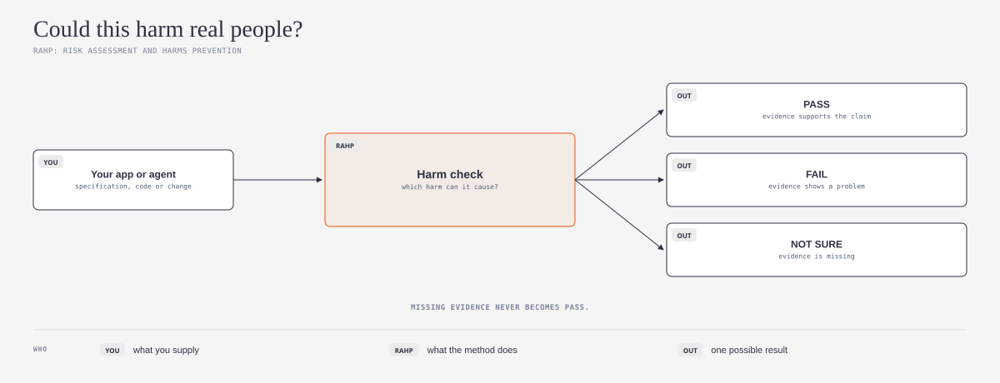
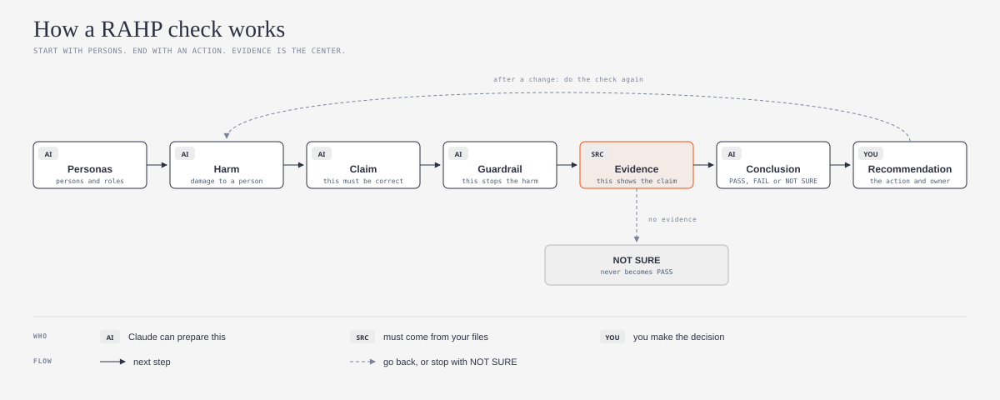
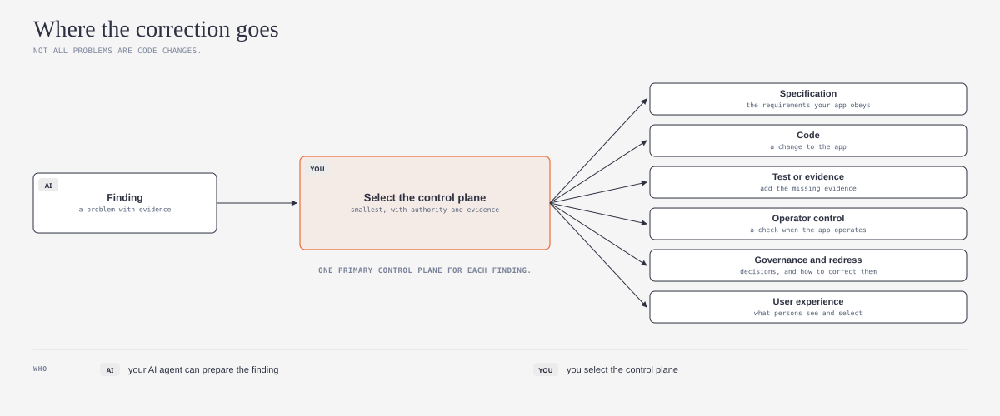

# rahp-toolkit-explained

## What is it?

This repository gives a simple explanation and an agent skill for the [RAHP Toolkit](https://github.com/sankarshanmukhopadhyay/rahp-toolkit) by [Sankarshan Mukhopadhyay](https://github.com/sankarshanmukhopadhyay). RAHP is "Risk Assessment and Harms Prevention". RAHP is a method that tells you if you can trust a system. The method starts with the persons that a system can harm. Then it finds the evidence that shows that a control stops each harm.



*Do you want the technical terms in simple words? Refer to the [Jargon Buster](JARGON.md).*

## What problem does it solve?

An AI app or agent can work correctly and still harm real people. For example, a valid signature does not prove that an action has permission. Before you trust your app or agent, ask one question: "Could this harm real people?" This skill helps your AI agent find the answer with you, step by step. It also shows you which answers have evidence.

## Who it is for

This is for vibe coders, builders, and other persons who are not risk specialists. You make apps or agents with AI tools. Before other persons use your app, you must know if it can cause harm.

It is not necessary to install the full RAHP Toolkit. It is not necessary to write code. The skill is one `SKILL.md` file in the open [Agent Skills](https://agentskills.io) format. Many AI agents can use it, for example Claude, Codex, and GitHub Copilot.

## Safe by default

1. **Read and draft first.** Your AI agent reads your files and writes drafts. The agent does not change, send, or delete data.
2. **Evidence comes from your files.** The agent must not make up evidence. If there is no evidence, the result is NOT SURE.
3. **Missing evidence never becomes PASS.** This is the primary rule of RAHP.
4. **You make the decisions.** The agent prepares findings. You make a decision about each finding and about the correct location for each correction.

## What it does

When you tell your AI agent to do a harm check, the skill tells the agent to do these steps with you:

1. Identify the item to examine, for example your app, a feature, or a change.
2. Identify the persons that the item can have an effect on, and their roles.
3. Find the possible harms to these persons.
4. Write each claim that must be correct for the item to be safe.
5. Find the guardrail or the control that stops each harm.
6. Find the evidence in your files for each control.
7. Give each claim a result: PASS, FAIL, or NOT SURE.
8. For each problem, find the correct location for the correction.

The skill also tells the agent to look for frequent errors. These are 3 examples:

1. A result of PASS with no evidence.
2. A valid credential that the app uses as evidence of permission.
3. A report with zero findings that the agent calls "safe".

## How it works

*The diagrams below use the visual language of [cathrynlavery/diagram-design](https://github.com/cathrynlavery/diagram-design):*



A RAHP check is a chain of 7 steps. It starts with persons and it stops with an action. Evidence is the center of the chain. Your AI agent can prepare most steps, but the evidence must come from your files. The memory of the agent is not evidence. If a claim has no evidence, the result is NOT SURE.

After you change the app, you do the check again for the parts that changed.



Not all problems are code changes. RAHP gives each finding 1 primary location for the correction. RAHP calls this location the "control plane". Select the smallest control plane that has the authority to make the change and a path to evidence. For example, a missing appeal process is a governance problem, not a code problem.

## How to install

The skill folder is this repository. Its name must be `rahp-harm-check`. Select the instructions for your AI agent.

### Claude

1. For the Claude apps (claude.ai or Claude desktop), download this repository as a ZIP file.
2. Open **Settings > Capabilities > Skills**, and upload the ZIP file.
3. For Claude Code, copy the folder to `~/.claude/skills/rahp-harm-check/`:

```
git clone https://github.com/ams-builds/rahp-toolkit-explained ~/.claude/skills/rahp-harm-check
```

### Codex

1. Copy the folder to `~/.agents/skills/rahp-harm-check/` for all your projects. For one project, use `.agents/skills/rahp-harm-check/` in that project.

```
git clone https://github.com/ams-builds/rahp-toolkit-explained ~/.agents/skills/rahp-harm-check
```

2. As an alternative, tell Codex to use `$skill-installer` with the URL of this repository.
3. If the skill does not show, start Codex again.

Source: [Codex documentation on skills](https://learn.chatgpt.com/docs/build-skills).

### GitHub Copilot

1. Copy the folder to `~/.copilot/skills/rahp-harm-check/` for all your projects. For one repository, use `.github/skills/rahp-harm-check/` in that repository.

```
git clone https://github.com/ams-builds/rahp-toolkit-explained ~/.copilot/skills/rahp-harm-check
```

2. Use Copilot in agent mode.

Source: [GitHub documentation on skills](https://docs.github.com/en/copilot/how-tos/copilot-cli/customize-copilot/create-skills).

These three agents had the most users in the [JetBrains 2026 survey](https://blog.jetbrains.com/research/2026/08/ai-coding-agent-adoption-2026/). Other agents that support Agent Skills use the same `SKILL.md` file.

## How to use it

After you install the skill, speak to your AI agent in your usual words:

- "Do a harm check of my app."
- "Can this agent cause harm to real persons?"
- "Which claims in my app have no evidence?"
- "Where does the correction for this problem go?"

The skill starts automatically. It is not necessary to use its name.

## Credit and license

This repository uses the [RAHP Toolkit](https://github.com/sankarshanmukhopadhyay/rahp-toolkit) by [Sankarshan Mukhopadhyay](https://github.com/sankarshanmukhopadhyay). The RAHP Toolkit started as the [DTG RAHP Toolkit](https://github.com/trustoverip/dtgwg-rahp-tf). A task force of the Decentralised Trust Graph Working Group (DTGWG) keeps that toolkit in the [Trust Over IP](https://github.com/trustoverip) GitHub organization. The name of the task force is the Risk Assessment and Harms Prevention Task Force. The 2 sources use the CC-BY 4.0 license.

This is an independent explanation in simple words. It is not an official part of the RAHP Toolkit or of the task force. I made this explanation. All errors in it are my errors.

Changes from the sources:

1. I wrote new text in simple words for persons who are not specialists.
2. I made 3 new diagrams.
3. I wrote an agent skill (`SKILL.md`) that applies a small part of the method to an app or an agent.
4. I did not copy the tools, schemas, catalogues, or worked examples. Refer to the sources for these.

This repository uses the [CC-BY 4.0](LICENSE) license. Refer to [NOTICE.md](NOTICE.md) for the attribution and the full list of changes.

---

*New terms? Refer to the [Jargon Buster](JARGON.md) for simple explanations of persona, harm, claim, guardrail, evidence, control plane, and more.*
